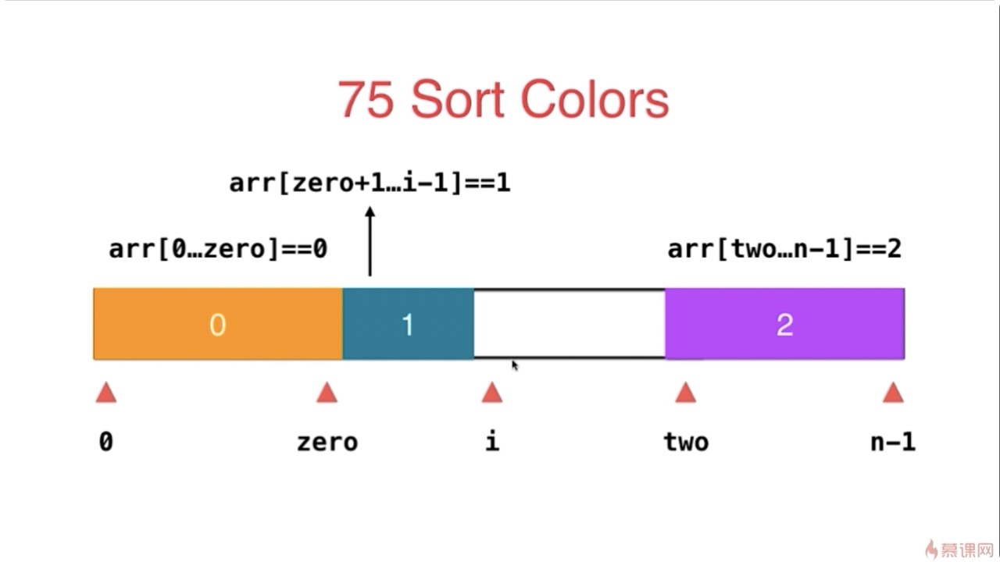

## 数组

### Two Pointer

#### 283-移动零

给定一个数组 nums，编写一个函数将所有 0 移动到数组的末尾，同时保持非零元素的相对顺序。

[动画演示 283.移动零](https://leetcode-cn.com/problems/move-zeroes/solution/dong-hua-yan-shi-283yi-dong-ling-by-wang_ni_ma/)

#### 27-移除元素
给你一个数组 nums 和一个值 val，你需要 原地 移除所有数值等于 val 的元素，并返回移除后数组的新长度。  
不要使用额外的数组空间，你必须仅使用 O(1) 额外空间并 原地 修改输入数组。  
元素的顺序可以改变。你不需要考虑数组中超出新长度后面的元素。

* 解题思路同 283

#### 26-删除排序数组重复元素
给定一个排序数组，你需要在 原地 删除重复出现的元素，使得每个元素只出现一次，返回移除后数组的新长度。

不要使用额外的数组空间，你必须在 原地 修改输入数组 并在使用 O(1) 额外空间的条件下完成。


#### 80-删除排序数组中的重复项 II
给定一个排序数组，你需要在原地删除重复出现的元素，使得每个元素最多出现两次，返回移除后数组的新长度。

不要使用额外的数组空间，你必须在原地修改输入数组并在使用 O(1) 额外空间的条件下完成。

链接：https://leetcode-cn.com/problems/remove-duplicates-from-sorted-array-ii

https://leetcode-cn.com/problems/remove-duplicates-from-sorted-array-ii/solution/zhi-jie-bian-li-yi-ci-ji-ke-by-luo-ben-zhu-xiao-ma/


#### 75-颜色分类
给定一个包含红色、白色和蓝色，一共 n 个元素的数组，原地对它们进行排序，使得相同颜色的元素相邻，并按照红色、白色、蓝色顺序排列。

此题中，我们使用整数 0、 1 和 2 分别表示红色、白色和蓝色。

链接：https://leetcode-cn.com/problems/sort-colors

解题：https://leetcode-cn.com/problems/sort-colors/solution/kuai-su-pai-xu-partition-guo-cheng-she-ji-xun-huan/



#### 88-合并两个有序数组

给你两个有序整数数组 nums1 和 nums2，请你将 nums2 合并到 nums1 中，使 nums1 成为一个有序数组。


#### 215-数组中的第K个最大元素

在未排序的数组中找到第 k 个最大的元素。请注意，你需要找的是数组排序后的第 k 个最大的元素，而不是第 k 个不同的元素

Java 借助 partition分区减治 O(n) https://leetcode-cn.com/problems/kth-largest-element-in-an-array/solution/java-jie-zhu-partitionfen-qu-jian-zhi-on-by-yankua/

#### 167-两数之和 II - 输入有序数组

给定一个已按照升序排列 的有序数组，找到两个数使得它们相加之和等于目标数。

函数应该返回这两个下标值 index1 和 index2，其中 index1 必须小于 index2。

链接：https://leetcode-cn.com/problems/two-sum-ii-input-array-is-sorted


#### 125-验证回文串

给定一个字符串，验证它是否是回文串，只考虑字母和数字字符，可以忽略字母的大小写。

说明：本题中，我们将空字符串定义为有效的回文串。

链接：https://leetcode-cn.com/problems/valid-palindrome/


#### 344-反转字符串

编写一个函数，其作用是将输入的字符串反转过来。输入字符串以字符数组 char[] 的形式给出。

不要给另外的数组分配额外的空间，你必须原地修改输入数组、使用 O(1) 的额外空间解决这一问题。

你可以假设数组中的所有字符都是 ASCII 码表中的可打印字符。

链接：https://leetcode-cn.com/problems/reverse-string


#### 345-反转字符串中的元音字母

编写一个函数，以字符串作为输入，反转该字符串中的元音字母。


#### 11-盛最多水的容器
给你 n 个非负整数 a1，a2，...，an，每个数代表坐标中的一个点 (i, ai) 。在坐标内画 n 条垂直线，垂直线 i 的两个端点分别为 (i, ai) 和 (i, 0)。找出其中的两条线，使得它们与 x 轴共同构成的容器可以容纳最多的水。

解题：https://leetcode-cn.com/problems/container-with-most-water/solution/sheng-zui-duo-shui-de-rong-qi-by-leetcode-solution/

### 滑动窗口

### 209-长度最小的子数组
给定一个含有 n 个正整数的数组和一个正整数 s ，找出该数组中满足其和 ≥ s 的长度最小的 连续 子数组，并返回其长度。如果不存在符合条件的子数组，返回 0。

链接：https://leetcode-cn.com/problems/minimum-size-subarray-sum

#### 3-无重复字符的最长子串
给定一个字符串，请你找出其中不含有重复字符的 最长子串 的长度。

#### 76

## 集合

#### 438-两个数组的交集

给定两个数组，编写一个函数来计算它们的交集。

#### 350-两个数组的交集 II

给定两个数组，编写一个函数来计算它们的交集


#### 242-有效的字母异位词

给定两个字符串 s 和 t ，编写一个函数来判断 t 是否是 s 的字母异位词。

#### 202-快乐数

编写一个算法来判断一个数 n 是不是快乐数。

「快乐数」定义为：对于一个正整数，每一次将该数替换为它每个位置上的数字的平方和，然后重复这个过程直到这个数变为 1，也可能是 无限循环 但始终变不到 1。如果 可以变为  1，那么这个数就是快乐数。

如果 n 是快乐数就返回 True ；不是，则返回 False 。

链接：https://leetcode-cn.com/problems/happy-number

#### 290-单词规律

给定一种规律 pattern 和一个字符串 str ，判断 str 是否遵循相同的规律。

这里的 遵循 指完全匹配，例如， pattern 里的每个字母和字符串 str 中的每个非空单词之间存在着双向连接的对应规律。

链接：https://leetcode-cn.com/problems/word-pattern

解题：https://leetcode-cn.com/problems/word-pattern/solution/xiang-xi-tong-su-de-si-lu-fen-xi-duo-jie-fa-by--53/

#### 205-同构字符串

给定两个字符串 s 和 t，判断它们是否是同构的。

如果 s 中的字符可以被替换得到 t ，那么这两个字符串是同构的。

所有出现的字符都必须用另一个字符替换，同时保留字符的顺序。两个字符不能映射到同一个字符上，但字符可以映射自己本身。


链接：https://leetcode-cn.com/problems/isomorphic-strings

#### 451-根据字符出现频率排序

给定一个字符串，请将字符串里的字符按照出现的频率降序排列。


#### 1-两数之和

给定一个整数数组 nums 和一个目标值 target，请你在该数组中找出和为目标值的那 两个 整数，并返回他们的数组下标。

#### 15-三数之和

给你一个包含 n 个整数的数组 nums，判断 nums 中是否存在三个元素 a，b，c ，使得 a + b + c = 0 ？请你找出所有满足条件且不重复的三元组。

链接：https://leetcode-cn.com/problems/3sum

**排序 + 双指针**


#### 18-四数之和

给定一个包含 n 个整数的数组 nums 和一个目标值 target，判断 nums 中是否存在四个元素 a，b，c 和 d ，使得 a + b + c + d 的值与 target 相等？找出所有满足条件且不重复的四元组。

链接：https://leetcode-cn.com/problems/4sum

#### 16-最接近的三数之和

给定一个包括 n 个整数的数组 nums 和 一个目标值 target。找出 nums 中的三个整数，使得它们的和与 target 最接近。返回这三个数的和。假定每组输入只存在唯一答案。

链接：https://leetcode-cn.com/problems/3sum-closest

**思路：排序 + 双指针**

#### 454-四数相加 II

给定四个包含整数的数组列表 A , B , C , D ,计算有多少个元组 (i, j, k, l) ，使得 A[i] + B[j] + C[k] + D[l] = 0。

为了使问题简单化，所有的 A, B, C, D 具有相同的长度 N，且 0 ≤ N ≤ 500 。所有整数的范围在 -228 到 228 - 1 之间，最终结果不会超过 231 - 1 。

**思路：HashMap**

#### 49-字母异位词分组

给定一个字符串数组，将字母异位词组合在一起。字母异位词指字母相同，但排列不同的字符串。

**思路：HashMap**

#### 447-回旋镖的数量

给定平面上 n 对不同的点，“回旋镖” 是由点表示的元组 (i, j, k) ，其中 i 和 j 之间的距离和 i 和 k 之间的距离相等（需要考虑元组的顺序）。

找到所有回旋镖的数量。你可以假设 n 最大为 500，所有点的坐标在闭区间 [-10000, 10000] 中。


链接：https://leetcode-cn.com/problems/number-of-boomerangs

#### 149-直线上最多的点数

给定一个二维平面，平面上有 n 个点，求最多有多少个点在同一条直线上。


### 滑动窗口 + 查找表

#### 219-存在重复元素 II

给定一个整数数组和一个整数 k，判断数组中是否存在两个不同的索引 i 和 j，使得 nums [i] = nums [j]，并且 i 和 j 的差的 绝对值 至多为 k。

链接：https://leetcode-cn.com/problems/contains-duplicate-ii


#### 217-存在重复元素

给定一个整数数组，判断是否存在重复元素。

如果任意一值在数组中出现至少两次，函数返回 true 。如果数组中每个元素都不相同，则返回 false 。

#### 220-存在重复元素 III

在整数数组 nums 中，是否存在两个下标 i 和 j，使得 nums [i] 和 nums [j] 的差的绝对值小于等于 t ，且满足 i 和 j 的差的绝对值也小于等于 ķ 。

如果存在则返回 true，不存在返回 false。

链接：https://leetcode-cn.com/problems/contains-duplicate-iii


## 链表

#### 206-反转链表

反转一个单链表。

```
输入: 1->2->3->4->5->NULL
输出: 5->4->3->2->1->NULL
```


#### 92